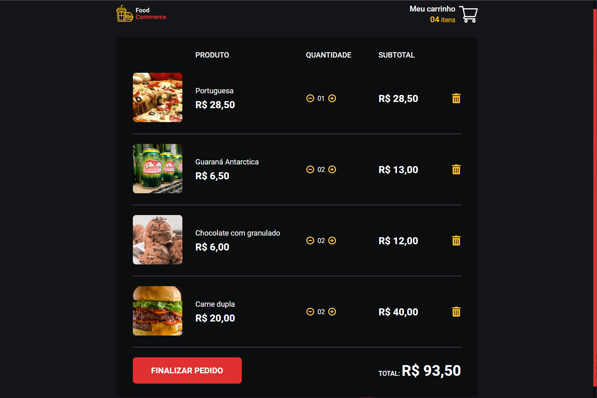

<div align="center">
<h1 align="center">🍔Food Commerce.<br> made with React. ⚛</h1>

</div>

&nbsp;

<p align="center">
  <a href="#Technologies">Technologies</a>&nbsp;&nbsp;&nbsp;|&nbsp;&nbsp;&nbsp;
  <a href="#Project">Project</a>&nbsp;&nbsp;&nbsp;|&nbsp;&nbsp;&nbsp;
  <a href="#License">License</a>
</p>

<p align="center">
 
  
  
</p>

<p align="center">
    
</p>

<br>

# New feature:

### Cart page implemmented:

<p align="center">
    
</p>

# 📄 Description

### What is this project? 📝

- This is a project made with React and Typescript, it is a food commerce, where you can add products to the cart and see the total price of the products.

# 🚀 Technologies

This project was developed with the following technologies:

### ReactJS 📝

### TypeScript 📝

### json-server 📝

### Axios 📝

### Styled Components 📝

### Polished 📝

### React Icons 📝

### React Router Dom 📝

### React Toastify 📝

### React Hooks 📝

### React Context API 📝

### Normalize 📝

How to run:

```bash

# Clone Repository

$ git clone

# Go to folder

$ cd food-commerce

# Run Application

$ npm start / yarn start


Go to http://localhost:3000/ to see the result.

```

# 🚧 Project

### [Live project!](https://food-commerce-seven.vercel.app) 🚀

# 🎨 Inspiration

# 📝 License

This project is under the MIT license. See the [LICENSE](../LICENSE.md) for more information.

<hr>

<p align="center">Made by <a href="https://jhonatanoliveira.com/" target="_blank">Jhonatan Oliveira</a>.</p>
